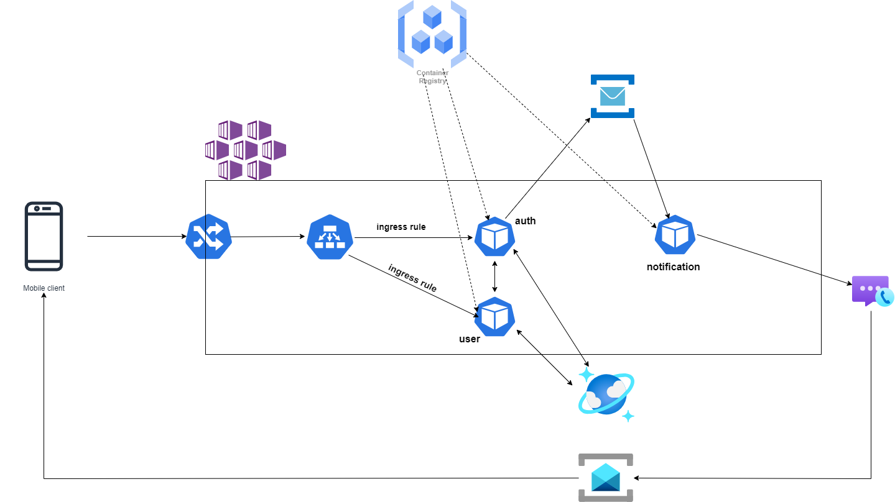

# ⚠️ Project still in development process

# azure-microservices

# Table of Contents

1. [Architecture](#architecture)
2. [Run the application](#how-to-run-the-application)
3. [Create the infrastructure with Terraform](#create-the-infrastructure-with-terraform)
4. [Destory the resources with Terraform](#destory-the-resources)

## Architecture

azure-microservices is built using Azure services, in particular:

- AKS: is a fully managed [Kubernetes](https://kubernetes.io/it/docs/concepts/overview/what-is-kubernetes/) service
- Azure Container Registry: is a fully managed repository for [Docker](https://www.docker.com/) images
- CosmosDB: is a fully managed NoSQL database
- Service Bus: is a message broker
- Communication Service: is a service that helps integrating communication in applications
- Email Service: API integrated with Azure Communication Service for sending email

## How to run the application

### Prerequisites

- An Azure subscription
- Docker engine installed on your system
- [kubectl](https://kubernetes.io/docs/tasks/tools/)
- [Node.js](https://nodejs.org/en) installed on your system (see .nvmrc files for node version used in this project)
- **Optional:** [Terraform](https://www.terraform.io/)
- **Optional** a UNIX-like system (or WSL2 if on Windows)

#### 1. Create your Azure infrastructure. 

If you want to run this application on Cloud, you need to create some Azure resources:

- AKS
- Azure Container Service
- CosmosDB
- Service Bus
- Communication Service
- Email Service

See also [Create the infrastructure with Terraform](#create-the-infrastructure-with-terraform)

#### 2. Build Docker images 

- First, clone the repo: <code>git clone https://github.com/aleRizzolo/azure-microservices.git</code>

- Open a shell inside the root folder of the project and give execution permission to <code>build_all.sh</code> file

- Follow the instructions displayed

#### 3. Create secrets for Kubernetes

All the microservices need secrets. These resources keep some important information, such as: database endpoint and Service Bus endpoint. To get these informations, go to Azure portal and select the resources that You have previously created and search for the Endpoint's url. After You get these information:

- base64 your string
- Paste the string in all the yaml files that require the information. 
  **_Example:_** copy CosmosDB endpoint, base64 the connectin string (you can use both the terminal or this [website](https://www.base64encode.org/)), copy the encoded stirng and paste it into <code>auth-env.yaml</code>, <code>user.yaml</code> files

#### 4. Apply all the configurations  

- To deploy all the configurations in Kubernetes, run the following command: 
  <code>kubectl apply -f k8s/</code>

  **_NOTE:_** before apply the command listed above, be sure to be in the project's root directory

#### 5. Create Ingress-Nignx resource

The Kubernetes cluster needs a resource, called [Ingress](https://kubernetes.io/docs/concepts/services-networking/ingress/) to be accessible from the outside. To create these resource, run the following command:
<code>kubectl apply -f https://raw.githubusercontent.com/kubernetes/ingress-nginx/controller-v1.7.1/deploy/static/provider/cloud/deploy.yaml</code>

#### 6. Build Android client

- Open the <code>client</code> folder with Andorid Studio and wait for Gradle to finish all the build process

- Run the command: <code>kubectl get pods -A</code> and copy the LoadBalancer 's correspondent Ip

- Paste the ip in Android Code (be sure to not delete the full path after the Ip address)

- Run the application (ADV or actual device, your choice!)

## Create the infrastructure with Terraform

If you have Terraform and you want an easy way to setup all the resources, follow these steps:

- go in <code>terraform/terraform.tfvars</code> file and change all the variables accordingly to your needs
- run <code>tarraform fmt</code>
- run <code>tarraform init</code>
- run <code>tarraform plan</code>
- run <code>tarraform apply</code> and when prompted enter <code>yes</code>

## Destory the resources with Terraform

If you created the infrastructure using Terraform run <code>terraform destory</code> in order to delete all the resources
